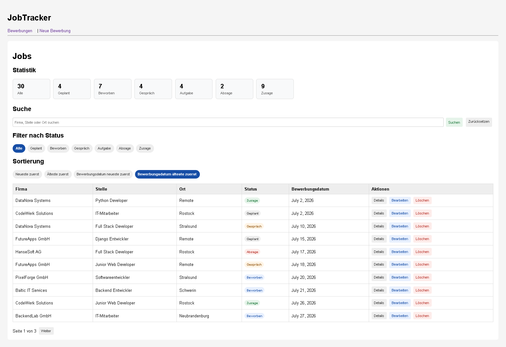
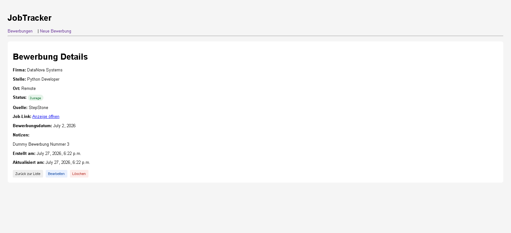
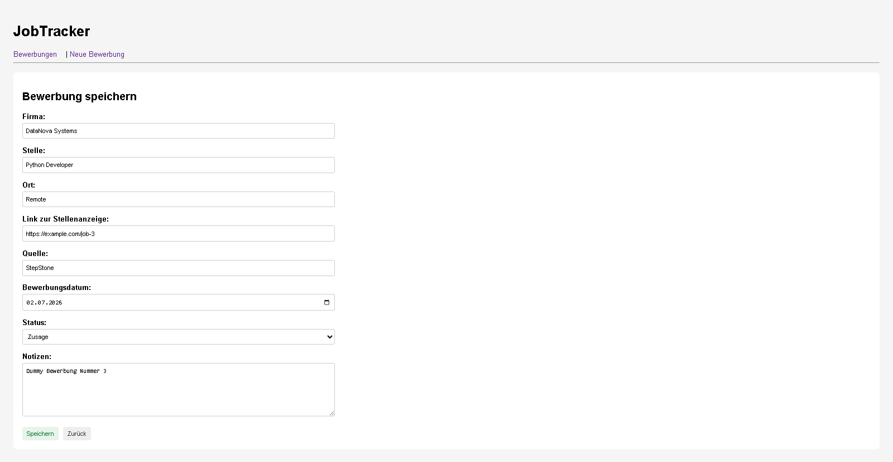

# JobTracker

JobTracker ist eine Django-Webanwendung zur Verwaltung von Bewerbungen.

Das Projekt hilft dabei, Bewerbungen strukturiert zu speichern, zu suchen, zu filtern, zu sortieren und den aktuellen Bewerbungsstatus besser im Blick zu behalten.

Der Fokus des Projekts liegt auf sauberer Backend-Entwicklung mit Django, Tests, Git-Workflow und einer schrittweisen professionellen Erweiterung.

---

## Ziel des Projekts

Bei vielen Bewerbungen kann man schnell den Überblick verlieren:

- Bei welcher Firma habe ich mich beworben?
- Welche Stelle war das?
- Welchen Status hat die Bewerbung?
- Wo habe ich die Stelle gefunden?
- Wann habe ich mich beworben?
- Gibt es Notizen oder wichtige Informationen?

JobTracker soll diese Informationen zentral verwalten und übersichtlich darstellen.

---

## Features

- Bewerbungen erstellen
- Bewerbungen anzeigen
- Bewerbungen bearbeiten
- Bewerbungen löschen
- Detailseite für einzelne Bewerbungen
- Dashboard mit Status-Statistik
- Suche nach Firma, Stelle und Ort
- Filter nach Bewerbungsstatus
- Sortierung nach Bewerbungsdatum und Erstellungsdatum
- Pagination für lange Bewerbungslisten
- Dummy-Daten-Generator für Entwicklungsdaten
- Verbesserte Formular-UX mit deutschen Labels
- Datumsauswahl im Formular
- Leere Liste mit verständlicher Meldung
- Automatische Tests

---

## Bewerbungsstatus

Aktuell unterstützt die Anwendung folgende Statuswerte:

- Geplant
- Beworben
- Gespräch
- Aufgabe
- Absage
- Zusage

---

## Technologien

- Python
- Django
- SQLite
- HTML
- CSS
- Git
- GitHub
- Django Test Framework

---

## Screenshots

### Bewerbungsübersicht



### Detailseite



### Bewerbungsformular



## Installation

Repository klonen:

```powershell
git clone https://github.com/mohamadanasfattoum/jobtracker.git
cd jobtracker
```

Virtuelle Umgebung erstellen und aktivieren:

```powershell
python -m venv .venv
.venv\Scripts\activate
```

Abhängigkeiten installieren:

```powershell
pip install -r requirements.txt
```

Datenbank vorbereiten:

```powershell
python manage.py migrate
```

Server starten:

```powershell
python manage.py runserver
```

Danach im Browser öffnen:

```text
http://127.0.0.1:8000/applications/
```

---

## Dummy-Daten erstellen

Für Entwicklungszwecke können automatisch Testdaten erzeugt werden.

30 gemischte Bewerbungen erstellen und vorhandene Daten vorher löschen:

```powershell
python manage.py seed_applications --count 30 --clear
```

Nur zusätzliche Dummy-Daten hinzufügen:

```powershell
python manage.py seed_applications --count 20
```

---

## Tests ausführen

```powershell
python manage.py test
```

Aktueller Stand:

```text
29 Tests
```

---

## Projektstruktur

```text
JobTracker
├── config/
├── JobApplication/
│   ├── management/
│   │   └── commands/
│   │       └── seed_applications.py
│   ├── templates/
│   │   └── JobApplication/
│   ├── admin.py
│   ├── forms.py
│   ├── models.py
│   ├── tests.py
│   ├── urls.py
│   └── views.py
├── static/
│   └── css/
│       └── style.css
├── templates/
│   └── base.html
├── manage.py
└── README.md
```

---

## Aktueller Projektstatus

Vorbereitung für Version `v0.1.0`.

Enthalten:

- CRUD-Funktionen
- Admin-Bereich
- Dashboard
- Status-Filter
- Suche
- Sortierung
- Pagination
- Detailseite
- Verbesserte Formular-UX
- Dummy-Daten-Generator
- Automatische Tests

---

## Geplante Erweiterungen

Für spätere Versionen sind weitere Funktionen geplant:

- PDF-Export für Bewerbungen
- Upload von Bewerbungsunterlagen
- Login und Benutzerverwaltung
- REST API
- Mobile Web-Version
- Spätere AI-Funktionen, zum Beispiel:
  - Anschreiben-Generator
  - Bewerbungsanalyse
  - Notizen-Zusammenfassung
  - E-Mail-Entwürfe
  - Job-Matching

---

## Projektfokus

Der Fokus liegt auf einer sauberen Django-Architektur, automatisierten Tests, klarer Projektstruktur und einem professionellen Git-Workflow.

---

## Autor

Mohamad Anas Fattoum

GitHub: mohamadanasfattoum